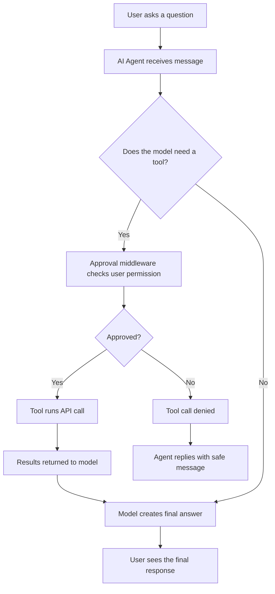

# AI Agent Beginner Guide

This project is a simple example of an AI agent. It is not just a normal chatbot that only replies with text. An agent can think, decide, and use tools to complete tasks.

For example, this agent can:
- answer general questions
- check the weather for a city
- fetch the latest news for a city
- ask for approval before using a tool

This makes it feel more like a helpful assistant than a basic chat model.

---

## What is an AI agent?

An AI agent is a program that uses a Large Language Model (LLM) as its brain and can take actions using tools.

A normal chatbot usually:
- receives a message
- sends it to an AI model
- returns a response

An AI agent usually does more:
1. Understands the user request
2. Decides whether it needs external information
3. Calls a tool or API if needed
4. Uses the returned data to answer better
5. Responds to the user in natural language

### Simple example

If you ask:

> What is the weather in London?

A normal chatbot may only say: "I don't know the current weather."

An agent can do this:
- detect that weather needs real-time data
- call the weather API
- get current temperature and condition
- answer with the result

That is the core idea of an agent: LLM + tools + decision-making.

---

## How this project works

This project uses:
- LangChain for agent orchestration
- Mistral AI as the language model
- custom tools for weather and news
- Tavily for searching news
- OpenWeather API for weather data
- a middleware function that asks for user approval before tool use

### System diagram

```svg
<svg width="820" height="340" viewBox="0 0 820 340" xmlns="http://www.w3.org/2000/svg" role="img" aria-label="AI Agent workflow diagram">
  <defs>
    <linearGradient id="bg" x1="0" x2="1">
      <stop offset="0%" stop-color="#f8fafc"/>
      <stop offset="100%" stop-color="#eef2ff"/>
    </linearGradient>
    <style>
      .box { fill: #ffffff; stroke: #3b82f6; stroke-width: 2; rx: 16; }
      .tool { fill: #ecfeff; stroke: #14b8a6; stroke-width: 2; rx: 14; }
      .api { fill: #fef3c7; stroke: #f59e0b; stroke-width: 2; rx: 14; }
      .text { font: 16px Arial, sans-serif; fill: #111827; }
      .small { font: 14px Arial, sans-serif; fill: #374151; }
      .arrow { stroke: #475569; stroke-width: 2.5; fill: none; marker-end: url(#arrowhead); }
    </style>
    <marker id="arrowhead" markerWidth="10" markerHeight="10" refX="8" refY="3" orient="auto">
      <path d="M0,0 L0,6 L9,3 z" fill="#475569"/>
    </marker>
  </defs>

  <rect x="0" y="0" width="820" height="340" fill="url(#bg)"/>

  <rect class="box" x="40" y="120" width="130" height="80"/>
  <text class="text" x="105" y="155" text-anchor="middle">User</text>
  <text class="small" x="105" y="176" text-anchor="middle">Question</text>

  <rect class="box" x="220" y="120" width="150" height="80"/>
  <text class="text" x="295" y="155" text-anchor="middle">AI Agent</text>
  <text class="small" x="295" y="176" text-anchor="middle">LLM + logic</text>

  <rect class="tool" x="430" y="60" width="150" height="70"/>
  <text class="text" x="505" y="92" text-anchor="middle">Weather Tool</text>
  <text class="small" x="505" y="110" text-anchor="middle">OpenWeather API</text>

  <rect class="tool" x="430" y="180" width="150" height="70"/>
  <text class="text" x="505" y="212" text-anchor="middle">News Tool</text>
  <text class="small" x="505" y="230" text-anchor="middle">Tavily Search</text>

  <rect class="api" x="640" y="120" width="150" height="80"/>
  <text class="text" x="715" y="155" text-anchor="middle">External Data</text>
  <text class="small" x="715" y="176" text-anchor="middle">Live APIs</text>

  <path class="arrow" d="M170 160 H220"/>
  <path class="arrow" d="M370 160 H430"/>
  <path class="arrow" d="M580 95 H640"/>
  <path class="arrow" d="M580 215 H640"/>
  <path class="arrow" d="M640 185 Q595 160 580 160"/>
  <path class="arrow" d="M640 170 Q590 160 580 160"/>

  <text class="small" x="189" y="145">message</text>
  <text class="small" x="395" y="145">decide</text>
  <text class="small" x="600" y="88">fetch</text>
  <text class="small" x="599" y="208">search</text>
  <text class="small" x="582" y="164">results</text>
</svg>
```

### Flowchart



The flow looks like this:

1. The user types a message
2. The agent sends the message to the model
3. The model decides if it needs a tool
4. If a tool is needed, the middleware asks for approval
5. The tool runs and returns data
6. The result is sent back to the model
7. The model generates a final answer

---

## Files in this project

### 1. agent.py
This is the main file that contains the agent logic.

It does the following:
- loads environment variables
- defines tools
- creates the model
- adds middleware approval check
- runs the interactive loop

### 2. main.py
This is another example project file. It shows a simpler LangChain setup using a model and tools in a basic loop.

### 3. pyproject.toml
This file stores project metadata and dependencies.

### 4. requirements.txt
This contains the Python packages required to run the project.

---

## Important concepts explained simply

### 1. LLM
An LLM is the "brain" of the agent. It reads the user request and decides what to do.

In this project, the model is:

```python
ChatMistralAI(model="mistral-small-2506")
```

This means the agent is using Mistral's language model to understand text and decide when to call tools.

### 2. Tool
A tool is a function that the agent can call to do something outside the model.

For example:

```python
@tool
def get_weather(city: str) -> str:
```

This makes `get_weather` available to the AI agent. If the model decides it needs weather information, it can call this function.

The tool then:
- reads the city name
- calls the OpenWeather API
- gets the weather report
- returns a clean response

### 3. Middleware
Middleware is code that runs between the model and the tool.

In this project:

```python
@wrap_tool_call
def human_approvel(request, handler):
```

This function asks the user:

> Agent wants to call 'get_weather'. Approve? (y/n):

This is important because it adds a safety layer. The agent cannot call tools silently without the user's approval.

### 4. Agent loop
The agent keeps waiting for user input in a loop:

```python
while True:
    user_input = input("You: ")
```

If the user types `0`, the program ends. Otherwise, the message is sent to the agent.

---

## The weather tool explained in detail

Here is the tool that gets city weather:

```python
@tool
def get_weather(city: str) -> str:
    api_key = os.getenv("OPENWEATHER_API_KEY")
    url = f"https://api.openweathermap.org/data/2.5/weather?q={city}&appid={api_key}&units=metric"

    response = requests.get(url)
    data = response.json()
```

### What happens here?
- `OPENWEATHER_API_KEY` is read from the environment
- a request is sent to the OpenWeather API
- the JSON response is parsed
- temperature and weather description are extracted
- a readable string is returned

Example output:

```text
weather in London: clear sky, 22 C
```

This is how a tool bridges the LLM with real-world data.

---

## The news tool explained in detail

The agent can also search for news using Tavily:

```python
@tool
def get_news(city: str) -> str:
    response = taviy_client.search(
        query=f"latest news in {city}",
        search_depth="basic",
        max_results=3
    )
```

This tool:
- creates a search query like "latest news in Paris"
- asks Tavily for matching search results
- extracts title, URL, and snippet
- formats the results into a readable list

So the agent can answer questions like:

> Give me the latest news about Tokyo

without being limited to its training data alone.

---

## Why this is an agent and not just a prompt

A prompt alone is only a static instruction given to a model. For example:

> Always answer nicely.

That is useful, but the model still cannot access live weather or news unless it is given a tool or API access.

This project goes beyond that by adding:
- actual actions
- API integration
- real-time data retrieval
- user approval before sensitive actions

That is what makes it an agent.

---

## Setup instructions

### 1. Install Python
Use Python 3.13 or newer, because the project configuration declares that requirement.

### 2. Create a virtual environment

```bash
python -m venv venv
```

Activate it:

On Windows:

```bash
venv\Scripts\activate
```

On macOS/Linux:

```bash
source venv/bin/activate
```

### 3. Install dependencies

```bash
pip install -r requirements.txt
```

### 4. Create a .env file
Create a file named `.env` in the project root and add:

```env
MISTRAL_API_KEY=your_mistral_key_here
OPENWEATHER_API_KEY=your_openweather_key_here
TAVILY_API_KEY=your_tavily_key_here
```

You can get these keys from:
- Mistral AI: model access and API key
- OpenWeather: weather API key
- Tavily: search API key

### 5. Run the agent

```bash
python agent.py
```

Then type a question like:

```text
What is the weather in Berlin?
```

or

```text
Tell me the latest news in Delhi
```

---

## Example conversation

```text
You: What is the weather in New York?
Agent wants to call 'get_weather'. Approve? (y/n): y
Bot: weather in New York: few clouds, 19 C
```

```text
You: Give me latest news in Mumbai
Agent wants to call 'get_news'. Approve? (y/n): y
Bot: latest news in Mumbai:
- ...
```

This shows the model asking the tool for live information, then using the returned data to answer.

---

## Why the approval step matters

This project asks for permission before tool execution. Why?

- to prevent accidental API calls
- to keep the user in control
- to make the agent safer and more transparent
- to help beginners understand when the AI is taking an action

With this pattern, the user is not surprised by hidden tool usage.

---

## Important note about the project

This project uses a Mistral model and external APIs. That means:
- the model needs a valid API key
- the tools need working API keys
- internet access is required
- tool results depend on live services

If any key is missing or invalid, the agent may not work correctly.

---

## Beginner takeaway

The core idea is simple:

An AI agent is a model that can do more than answer text. It can interact with the real world through tools, fetch live data, and produce better responses based on that information.

This project is a great beginner example because it shows:
- how an LLM is used
- how tools are defined
- how agent decisions are made
- how APIs are called
- how user approval can be added

---

## Next ideas to learn

Once you understand this project, you can extend it by adding:
- a calculator tool
- a memory system
- web search with more advanced search APIs
- database access
- file reading and writing
- multi-step workflows

This is the foundation of real-world autonomous AI systems.

---

## License

This project is a learning example created for educational purposes.

---

## Author

Rajan-sharma-0
